# MSX_AC-HB3_CONNECTOR
SONY製（HB-F1など）やPanasonic製（FS-A1など）の一部MSX機種で採用されている、特殊な形状のACアダプタのコネクタ部分について3Dモデルとして試作してみたものです。SONY製の場合のACアダプタの型番はAC-HB3の模様です（未所有）。

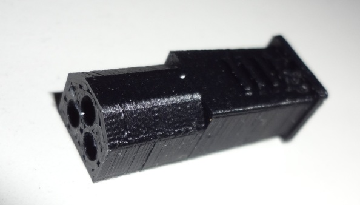

# 特殊な形状のACアダプタコネクタ
入力電圧（DC9VとAC12Vの両方）も特殊ながら、コネクタが市販されていない形状であり補修が難しいです。

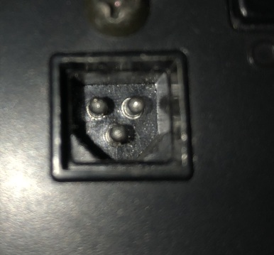

# 注意事項
当方は3Dモデリングも3Dプリンタ利用も初めてで、対象のACアダプター自体も所有していないため、形状の測定も設計もいい加減です。
本モデルを利用してソケット部分が故障したりしても責任は取れません。可能であれば、改善版を共有頂けますとありがたいです。

# 電気的に接続する部分について
AliExpressで購入した2mmΦのバナナプラグ（メス側）を使用しています。 
購入したSHOP:https://ja.aliexpress.com/item/4000439855711.html 

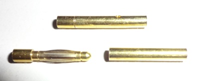

精度にバラツキがあるので、ちゃんと受け口にしっかりハマるものを選びます。 
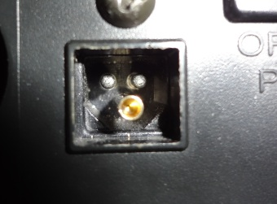

# モデルについて
OpenSCADで設計しました。srcディレクトリ内にソースも共有しています。モデルのSTLはstlディレクトリにあります。 
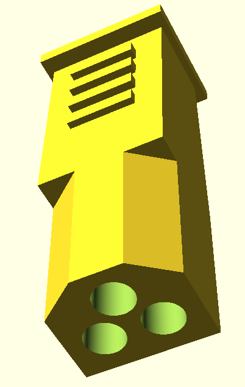

穴の部分については、バナナプラグ用の穴と細い穴をつなげて、ケーブルだけが接続できるようにしています。 
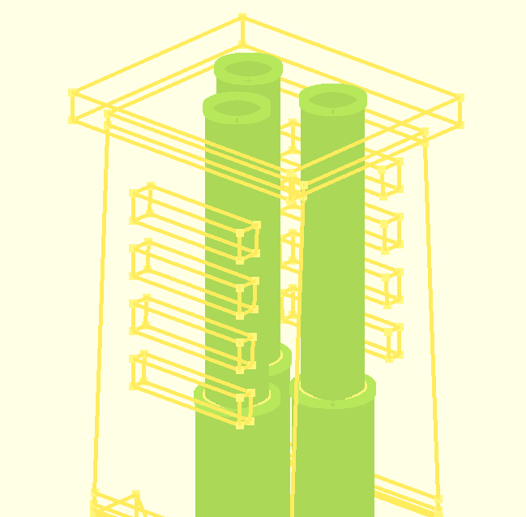
緑色がモデルにあいている穴で、下側の太い方がバナナプラグ用です。

# ケーブルなどの接続について
DC9VとAC12Vの電源をどのように準備するか、どのように接続するかなどの説明はしません。あくまでコネクタのモデルを3Dプリントしたあとどのように扱うかの手順です。 
1. あらかじめケーブルを通してバナナプラグ（メス側）にはんだ付けします。 
このとき3Dプリントしたモデルは熱に弱いので気を付けること。 
接合部は、はんだ付けだけでなくレジンなどで固めた方がいいかも知れませんが、はみ出すとモデル部に収まらなくなります。 
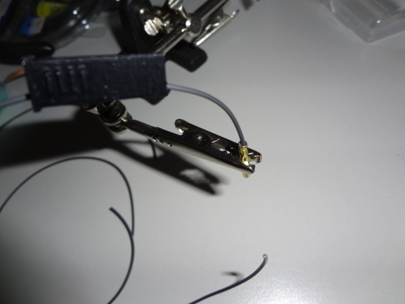
2. 穴の部分にバナナプラグを押し込みます。 
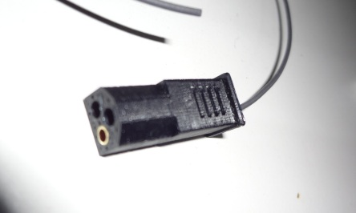
3. ケーブルを電源プラグの受け口などと接続したら完成です。 
必要に応じて接合部を熱収縮チューブで覆うなど処理してください。 
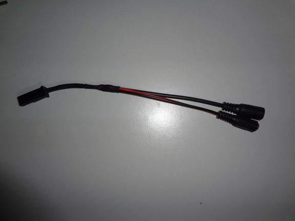

# 完成品の画像
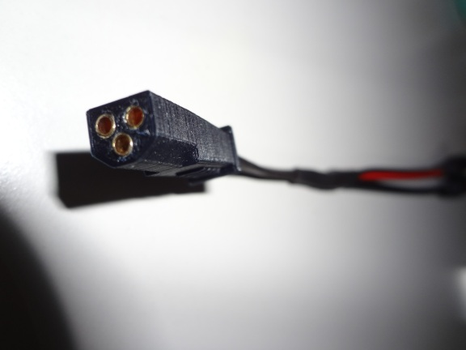
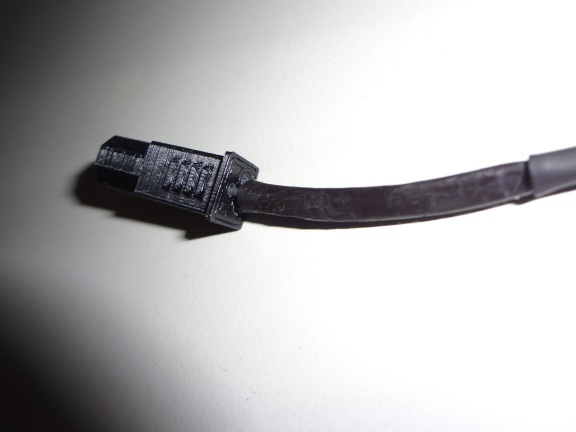
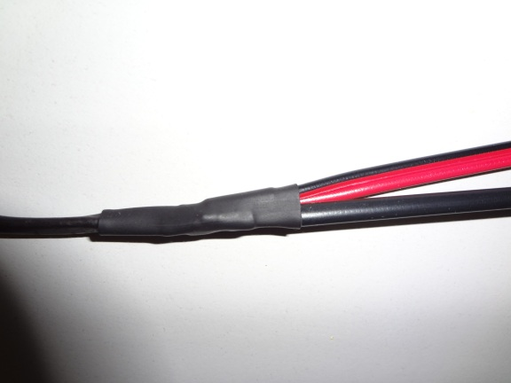
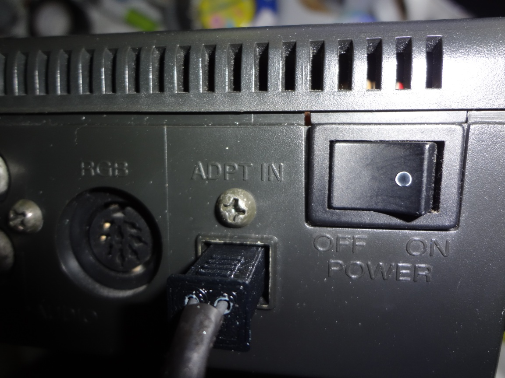
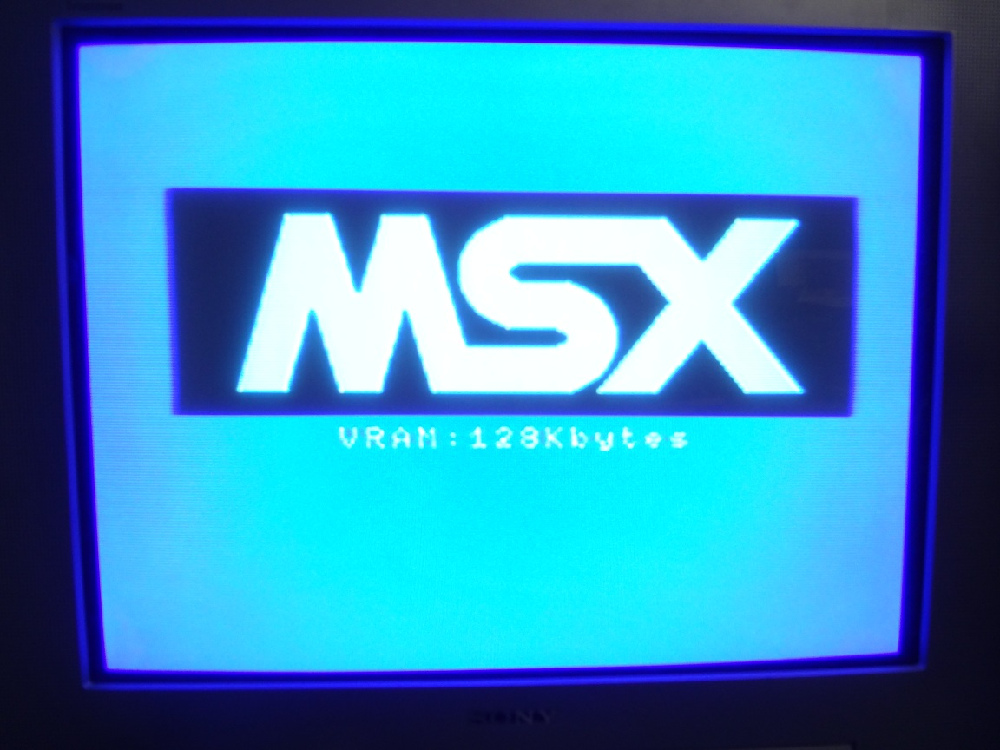
